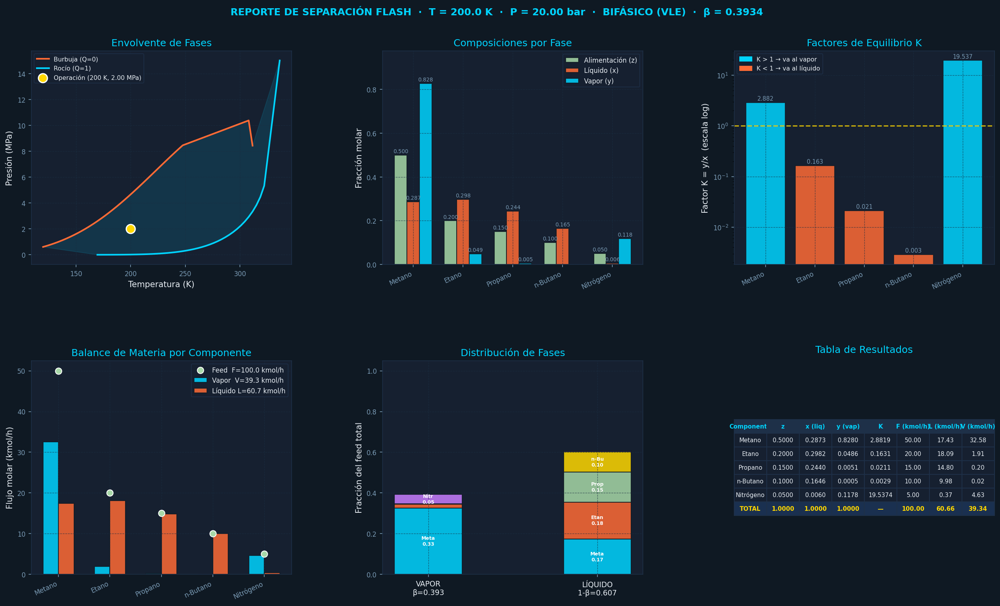

# ⚗️ Calculadora de Separación Flash Multicomponente
[](https://colab.research.google.com/github/benmoraing2019/calculadora_termodinamica/blob/main/main.ipynb)


Herramienta de simulación termodinámica para separación flash vapor-líquido (VLE) de mezclas multicomponente, construida sobre **CoolProp HEOS** con el estándar **GERG-2008**.

---



---

## 📋 Descripción

Este modelo calcula el equilibrio líquido-vapor de mezclas multicomponente a condiciones especificadas de temperatura y presión (flash PT). Está orientado a ingeniería química de planta y entrega resultados de balances de materia, composiciones por fase, factores de equilibrio K y envolvente de fases.

## 🗂️ Estructura del Proyecto

```
CALCULADORA_TERMODINAMICA/
├── .devcontainer/
│   ├── devcontainer.json    # Configuración del contenedor de desarrollo
│   └── requirements.txt     # Dependencias del entorno DevContainer
├── docs/                    # Documentación adicional
├── src/
│   ├── common/
│   │   └── config.json      # Configuración de mezcla y condiciones
│   └── services/
│       ├── ConfigManager.py # Lectura y gestión de configuración
│       ├── FlashModel.py    # Modelo termodinámico (CoolProp)
│       └── PlotService.py   # Visualizaciones para ingeniería de planta
├── test.py                  # Script de prueba
├── flash_calculator.ipynb   # Notebook interactivo (Jupyter / Colab)
├── main.ipynb               # Notebook principal
├── flash_dashboard.png      # Ejemplo de salida gráfica
├── resultados.csv           # Resultados exportados
└── requirements.txt         # Dependencias raíz
```

## 🐳 Entorno de Desarrollo (DevContainer)

Este proyecto está configurado para correr en un **DevContainer** de VS Code, lo que garantiza un entorno reproducible sin instalaciones manuales.

### Requisitos previos

- [VS Code](https://code.visualstudio.com/)
- Extensión [Dev Containers](https://marketplace.visualstudio.com/items?itemName=ms-vscode-remote.remote-containers)
- [Docker Desktop](https://www.docker.com/products/docker-desktop/)

### Levantar el entorno

```bash
# 1. Clonar el repositorio
git clone <url-del-repo>
cd CALCULADORA_TERMODINAMICA

# 2. Abrir en VS Code
code .

# 3. VS Code detectará el .devcontainer y mostrará:
#    "Reopen in Container" → hacer clic
```

El contenedor instala automáticamente todas las dependencias definidas en `.devcontainer/requirements.txt`.

### Estructura del `devcontainer.json`

```json
{
    "name": "Calculadora Termodinamica",
    "image": "mcr.microsoft.com/devcontainers/python:3.10",
    "postCreateCommand": "pip install -r .devcontainer/requirements.txt",
    "customizations": {
        "vscode": {
            "extensions": [
                "ms-python.python",
                "ms-toolsai.jupyter"
            ]
        }
    }
}
```

### Instalación manual (sin DevContainer)

```bash
pip install -r requirements.txt
```

Dependencias principales:

```txt
CoolProp>=6.4.1
numpy
pandas
matplotlib
ipywidgets
```

## 🚀 Uso rápido

### Desde script Python

```python
from src.services.ConfigManager import ConfigManager
from src.services.FlashModel import FlashModel
from src.services.PlotService import PlotService

# Cargar configuración desde config.json
cfm = ConfigManager()

# Instanciar el modelo (T en Kelvin, P en Pascales)
fm = FlashModel(temperature=200, pressure=2e6, config_manager=cfm)

print(fm.get_phase_name())   # "Bifasico (VLE)"
print(fm.get_results())      # dict con beta, x, y, K

# Generar dashboard de visualizaciones
ps = PlotService(fm)
ps.dashboard(save_path="flash_dashboard.png")
ps.export_csv("resultados.csv")
```

### Desde Jupyter / Google Colab

Abre `flash_calculator.ipynb` y ejecuta las celdas en orden. La interfaz interactiva te permite:

- Ajustar **T** y **P** con sliders
- Activar/desactivar componentes con checkboxes
- Ingresar fracciones molares con normalización automática
- Visualizar el dashboard completo
- Exportar resultados a CSV

## 🧬 Configuración de la mezcla (`config.json`)

```json
{
    "mezcla": [
        { "id_espanol": "Metano",    "coolprop_name": "Methane",  "z_fraccion_molar": 0.50 },
        { "id_espanol": "Etano",     "coolprop_name": "Ethane",   "z_fraccion_molar": 0.20 },
        { "id_espanol": "Propano",   "coolprop_name": "Propane",  "z_fraccion_molar": 0.15 },
        { "id_espanol": "n-Butano",  "coolprop_name": "n-Butane", "z_fraccion_molar": 0.10 },
        { "id_espanol": "Nitrogeno", "coolprop_name": "Nitrogen", "z_fraccion_molar": 0.05 }
    ],
    "simulacion": {
        "feed": { "flow_kmol_h": 100.0 },
        "flash": {
            "temperature_K": 200.0,
            "pressure_Pa": 2000000.0
        }
    }
}
```

## 📊 Visualizaciones del Dashboard

| Panel | Descripción |
|-------|-------------|
| **Envolvente de fases** | Curvas de burbuja y rocío (P-T), con punto de operación |
| **Composiciones por fase** | Barras agrupadas z / x (líquido) / y (vapor) por componente |
| **Factores K (log)** | K = y/x en escala logarítmica; K>1 va al vapor, K<1 al líquido |
| **Balance de materia** | Flujos molares (kmol/h) en vapor y líquido por componente |
| **Distribución de fases** | Barras apiladas de fracción del feed en cada fase |
| **Tabla de resultados** | z, x, y, K, F, L, V para todos los componentes + totales |

## 🧪 Componentes soportados (GERG-2008)

Solo se aceptan componentes del estándar GERG-2008, que garantizan parámetros de interacción binaria completos en CoolProp HEOS:

| Grupo | Componentes |
|-------|-------------|
| Gases ligeros | Methane, Nitrogen, CO2, Ethane, Hydrogen, H2S, Oxygen, CO, Water |
| Hidrocarburos | Propane, n-Butane, IsoButane, n-Pentane, Isopentane, n-Hexane, n-Heptane, n-Octane, n-Decane |
| Nobles | Helium, Argon, Neon |

> ⚠️ Componentes fuera de esta lista (ej. Benceno, aromáticos, refrigerantes) requieren asignar parámetros de interacción binaria manualmente con `set_binary_interaction_double()`.

## 📐 Fundamento Termodinámico

- **Backend:** CoolProp HEOS (Helmholtz Energy Equation of State)
- **Modelo de mezcla:** GERG-2008 (Kunz & Wagner)
- **Tipo de flash:** PT (temperatura y presión especificadas)
- **Inputs del solver:** `CP.PT_INPUTS`
- **Outputs:** fracción de vapor β, composiciones x/y, factores K, propiedades termodinámicas

## 🗃️ Salida CSV

El archivo `resultados.csv` contiene por componente:

```
Componente, z, x_liquido, y_vapor, K, F_kmolh, L_kmolh, V_kmolh
```

## 📄 Licencia

MIT License — libre uso académico y comercial.